# 1、需求描述

CinderX 是一个 Python 扩展模块，旨在提升 Python 运行时的性能。它由 Meta 开发，最初源自 Cinder（CPython 的一个分支），现已转变为一个可独立安装的扩展模块，支持标准的 CPython 运行时。

## 1.1、受益人

| 角色 | 角色描述 |
|:--|:-------|
| Python 应用开发者 | 通过 JIT 编译、Static Python 和轻量级帧优化获得性能提升并降低服务延迟和资源消耗，无需修改现有代码 |
| 性能工程师 | 利用 JIT 编译、类型特化等特性进行深度性能优化 |

## 1.2、依赖组件

| 组件 | 组件描述 | 可获得性 |
|:--|:-------|:------|
| CPython 3.14.3+ | 标准的 Python 解释器运行时 | 官方发布 |
| asmjit | 汇编代码生成库 | GitHub 开源 |
| fmt | C++ 格式化库 | GitHub 开源 |
| parallel-hashmap | 高性能哈希表库 | GitHub 开源 |
| usdt | 用户态静态定义追踪 | GitHub 开源 |
| zlib | 压缩库 | 系统自带或 GitHub 开源 |

## 1.3、License

MIT License

# 2、架构目标

## 2.1、架构目标

CinderX 的核心架构目标是**作为 CPython 的扩展模块而非分支**运行，这决定了其与 CPython 之间的边界设计原则：

1. **最小侵入性**：通过标准的 Python C API 和有限的内部 API 与 CPython 交互
2. **版本兼容性**：支持 CPython 3.14.3+，通过抽象层屏蔽版本差异
3. **可插拔性**：可以动态加载和卸载，不修改 CPython 核心代码
4. **性能优先**：在边界设计上允许必要的底层访问以实现高性能优化

## 2.2、关键架构需求

| 需求名称 | 需求描述 | 需求类别 | 需求优先级 |
|:--|:-------|:------|:-----|
| JIT 编译 | 将 Python 字节码编译为本地机器码 | 功能 | 高 |
| Static Python | 提供更严格的 Python 子集以实现类型安全和优化 | 功能 | 高 |
| 多版本兼容 | 支持 CPython 3.14.3+ | 兼容性 | 高 |
| 帧评估器替换 | 通过 PEP 523 钩子替换解释器帧评估函数 | 功能 | 高 |
| 去优化支持 | 支持从 JIT 代码回退到解释器执行 | 可靠性 | 高 |
| 轻量级帧 | 减少帧对象内存开销 | 性能 | 中 |

## 2.3 假设和约束

- **运行环境**：Linux ARM64、X86_64（主要支持），不支持 macOS、Windows
- **编译器要求**：GCC 13+ 或 Clang 18+
- **Python 版本**：Python 3.14.3+（完整支持），暂不兼容 Meta 的 CPython 分支
- **GIL 依赖**：当前主要针对 GIL 模式设计，free-threading 支持正在开发中

## 2.4 架构原则

| 原则 | 原则描述 | 举例 |
|:--|:-------|:------|
| 扩展优先原则 | 通过 Python C API 和扩展机制与 CPython 交互，避免修改 CPython 源码 | 使用 `PyModuleDef` 定义模块，通过 `PyFunction_Watch` 监控函数 |
| 版本抽象原则 | 通过移植层屏蔽不同 CPython 版本的 API 差异 | `py-portability.h` 提供跨版本的宏和内联函数 |
| 借用代码原则 | 从 CPython 借用必要的内部函数，重命名以避免符号冲突 | `borrowed.h` 中重定义 `_PyFrame_ClearExceptCode` 为 `_CiFrame_ClearExceptCode` |
| 监听器模式 | 通过监听器机制响应 CPython 运行时事件 | 使用 Code/Dict/Func/Type Watcher 监控对象生命周期 |
| 单向依赖原则 | CinderX 依赖 CPython，CPython 不依赖 CinderX | 所有交互通过 CPython 提供的 API 或钩子实现 |

# 3、用例视图

## 3.1、上下文模型

### 3.1.1、上下文视图

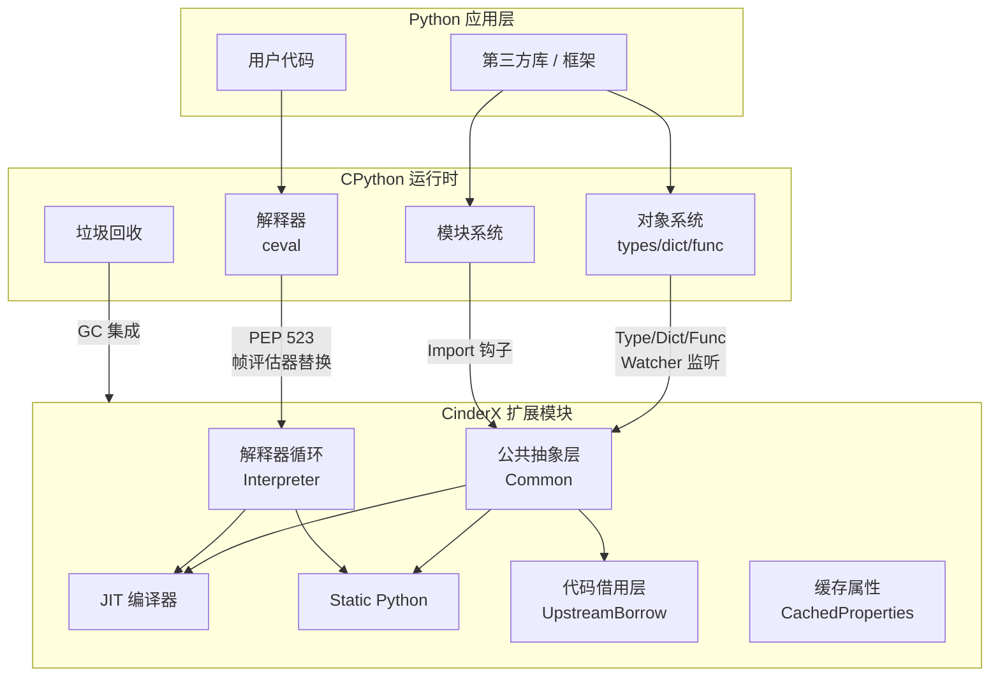

### 3.1.2、 CinderX 与 CPython 边界设计

CinderX 与 CPython 之间的边界通过三层抽象实现，从上到下依次为业务功能层、公共抽象层、代码借用层：

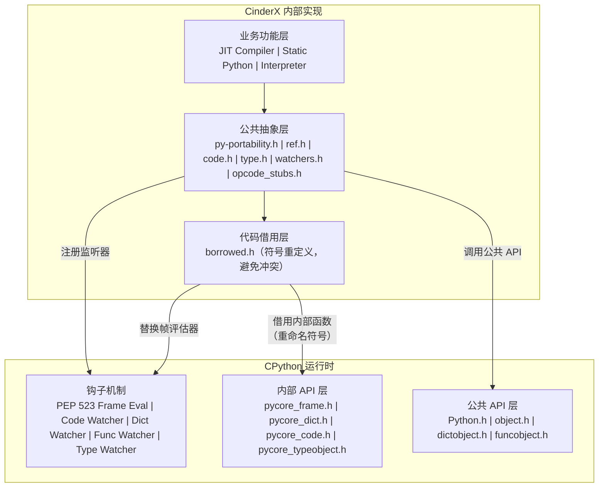

### 3.1.3、外部接口描述

| 接口编号 | 类型 | 接口描述 | 规格 |
|:--|:-------|:------|:----|
| EXT-001 | Python API | `cinderx.jit.auto()` - 自动 JIT 编译 | 启动后自动编译热点函数 |
| EXT-002 | Python API | `cinderx.jit.force_compile(func)` - 强制编译指定函数 | 同步编译，返回编译结果 |
| EXT-003 | Python API | `cinderx.jit.lazy_compile(func)` - 延迟编译 | 下次调用时编译 |
| EXT-004 | C API | `PyInit__cinderx()` - 模块初始化入口 | Python 扩展标准入口 |
| EXT-005 | C API | `Ci_EvalFrame()` - 帧评估函数 | 替换 CPython 默认帧评估器 |

## 3.2、USE-CASE 模型

### 3.2.1、USE-CASE 视图

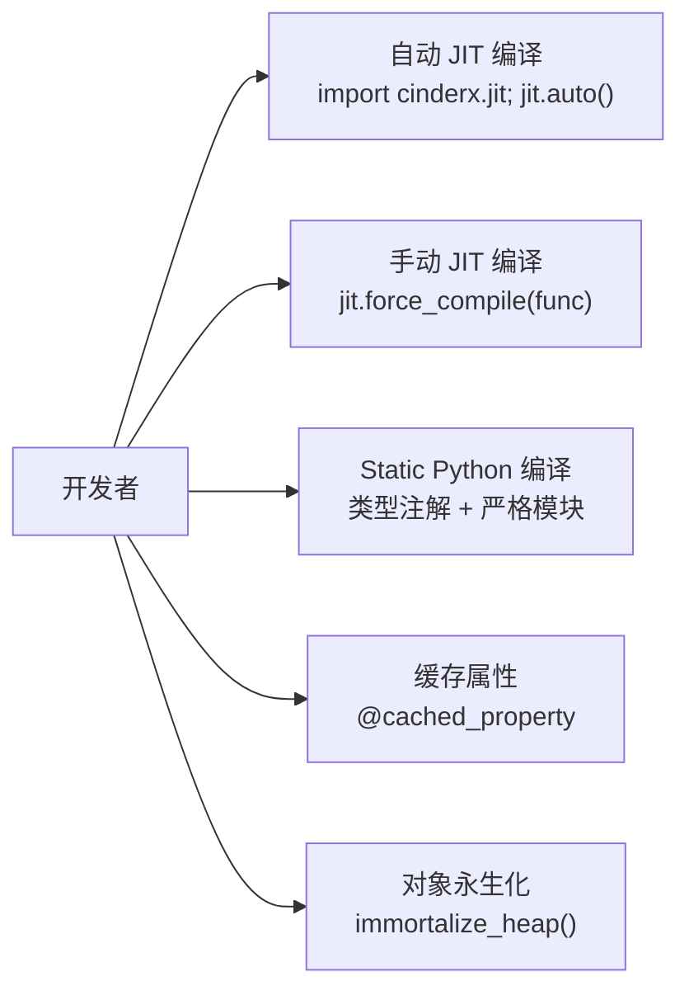

## 3.3、逻辑视图

### 3.3.1、模块架构

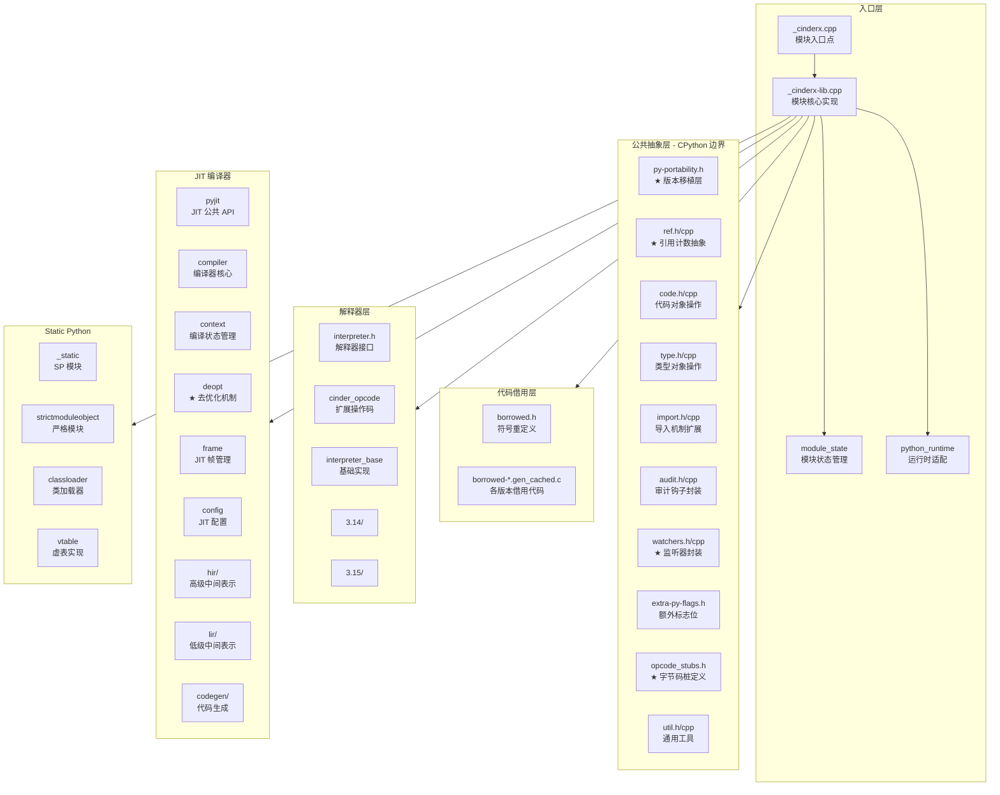

### 3.3.2、 CinderX 与 CPython 边界交互机制

#### 1. 帧评估器替换（Frame Evaluator Replacement）

CinderX 通过 PEP 523 定义的 `_PyFrameEvalFunction` 钩子替换 CPython 的默认帧评估函数：

```c
// interpreter.h
#if PY_VERSION_HEX < 0x030C0000
PyObject* _Py_HOT_FUNCTION
Ci_EvalFrame(PyThreadState* tstate, PyFrameObject* f, int throwflag);
#else
PyObject* _Py_HOT_FUNCTION Ci_EvalFrame(
    PyThreadState* tstate,
    struct _PyInterpreterFrame* f,
    int throwflag);
#endif

// 安装和移除帧评估器
int Ci_InitFrameEvalFunc();
void Ci_FiniFrameEvalFunc();
```

#### 2. 对象监听器（Object Watchers）

CinderX 使用 CPython 提供的监听器机制监控关键对象的变化：

```c
// watchers.h
using CodeWatcher = int (*)(PyCodeEvent, PyCodeObject*);
using DictWatcher = int (*)(PyDict_WatchEvent, PyObject*, PyObject*, PyObject*);
using FuncWatcher = int (*)(PyFunction_WatchEvent, PyFunctionObject*, PyObject*);
using TypeWatcher = int (*)(PyTypeObject*);

class WatcherState {
  int code_watcher_id_{-1};
  int dict_watcher_id_{-1};
  int func_watcher_id_{-1};
  int type_watcher_id_{-1};
  // ...
};
```

监听器回调示例：

```c
// _cinderx-lib.cpp
int cinderx_code_watcher(PyCodeEvent event, PyCodeObject* co) {
  switch (event) {
    case PY_CODE_EVENT_DESTROY:
      jit::codeDestroyed(co);
      break;
  }
  return 0;
}

int cinderx_func_watcher(PyFunction_WatchEvent event, PyFunctionObject* func, PyObject* new_value) {
  switch (event) {
    case PyFunction_EVENT_CREATE:
      func->vectorcall = getInterpretedVectorcall(func);
      scheduleCompile(func);
      break;
    case PyFunction_EVENT_DESTROY:
      jit::funcDestroyed(func);
      break;
  }
  return 0;
}
```

#### 3. 版本移植层（Portability Layer）

`py-portability.h` 提供跨 CPython 版本的抽象：

```c
// 帧结构差异抽象
#if PY_VERSION_HEX >= 0x030C0000
inline _PyInterpreterFrame* currentFrame(PyThreadState* tstate) {
#if PY_VERSION_HEX >= 0x030D0000
  return tstate->current_frame;
#else
  return tstate->cframe->current_frame;
#endif
}

// 栈引用差异抽象
#if PY_VERSION_HEX < 0x030E0000
#define Ci_STACK_TYPE PyObject*
#define Ci_STACK_NULL NULL
#else
#define Ci_STACK_TYPE _PyStackRef
#define Ci_STACK_NULL PyStackRef_NULL
#endif
```

#### 4. 代码借用机制（Upstream Borrow）

从 CPython 借用内部函数，通过宏重命名避免符号冲突：

```c
// borrowed.h
#define _PyFrame_ClearExceptCode _CiFrame_ClearExceptCode
#define _PyObject_HasLen _CiPyObject_HasLen
#define _PyEval_Vector _CiEval_Vector
#define _PyType_LookupRefAndVersion _CiType_LookupRefAndVersion
// ... 更多重定义
```

#### 5. 引用计数抽象（Reference Abstraction）

`ref.h` 提供类型安全的引用管理：

```cpp
// 借用引用 - 不持有所有权
template <typename T = PyObject>
class BorrowedRef : public RefBase<T>;

// 持有引用 - 自动管理引用计数
template <typename T = PyObject>
class Ref : public RefBase<T> {
  ~Ref() { Py_XDECREF(ptr_); }
  static Ref steal(T* obj);  // 窃取引用
  static Ref create(T* obj); // 创建新引用
};
```

#### 6. 去优化机制（Deoptimization）

当 JIT 代码无法继续执行时，安全地回退到解释器：

```cpp
// deopt.h
struct DeoptMetadata {
  FrozenList<LiveValue> live_values;      // 活跃值
  FrozenList<DeoptFrameMetadata> frame_meta; // 帧元数据
  DeoptReason reason;                      // 去优化原因
  int guilty_value{-1};                    // 导致去优化的值
};

// 重建解释器帧
void reifyFrame(
    CiPyFrameObjType* frame,
    const DeoptMetadata& meta,
    const DeoptFrameMetadata& frame_meta,
    const uint64_t* regs);
```

## 3.4、开发视图

### 3.4.1、目录与模块映射

| 目录 | 模块 | 职责 | 与 CPython 边界 |
|:--|:-------|:------|:-----|
| Common/ | 公共抽象层 | 提供跨版本抽象和基础工具 | 直接调用 CPython API |
| UpstreamBorrow/ | 代码借用层 | 借用 CPython 内部函数 | 复制并重命名 CPython 内部代码 |
| Interpreter/ | 解释器层 | 自定义字节码解释器 | 替换 CPython 帧评估器 |
| Jit/ | JIT 编译器 | 字节码到机器码编译 | 通过公共抽象层间接调用 |
| StaticPython/ | 静态 Python | 类型特化优化 | 扩展 Python 类型系统 |

### 3.4.2、构建系统

CinderX 的最终发布产物为 **wheel 包**（`.whl`），构建流水线由 setuptools 编排，CMake 作为其中的编译环节：

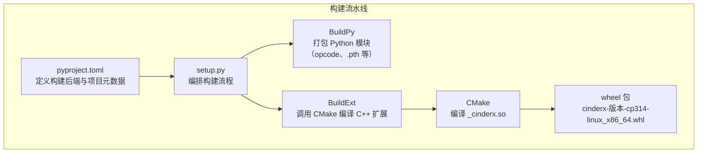

#### 1. 项目元数据（pyproject.toml）

定义构建后端、Python 版本要求和 cibuildwheel 配置：

```toml
[build-system]
requires = ["setuptools >= 77.0.3"]
build-backend = "setuptools.build_meta"

[project]
name = "cinderx"
requires-python = ">= 3.14.0, < 3.16"

[tool.cibuildwheel]
build = ["cp314-manylinux_x86_64", "cp314-musllinux_x86_64"]
environment = { CINDERX_ENABLE_PGO = "1", CINDERX_ENABLE_LTO = "1" }
```

#### 2. 构建编排（setup.py）

通过自定义 setuptools 命令编排构建流程：

| 命令 | 职责 |
|:--|:------|
| `BuildCommand` | 顶层构建入口，支持 PGO（Profile-Guided Optimization）三阶段构建 |
| `BuildPy` | 打包 Python 模块，生成版本特定的 opcode.py、.pth 文件等 |
| `BuildExt` | 调用 CMake 编译 C++ 扩展模块 `_cinderx` |

#### 3. CMake 编译环节

CMake 由 `BuildExt` 调用，负责将 C++ 源码编译为 `_cinderx.so` 共享库：

```cmake
# 主要库目标
add_library(common ${COMMON_SOURCES})        # 公共抽象层
add_library(borrowed ${BORROWED_C})          # 借用代码
add_library(interpreter ${INTERP_SOURCES})   # 解释器
add_library(jit ${JIT_SOURCES})              # JIT 编译器
add_library(static-python ${STATIC_PYTHON_SOURCES})  # Static Python

# 最终模块
add_library(_cinderx SHARED ${SOURCES})
target_link_libraries(_cinderx PRIVATE
  Python::Module borrowed cached-properties common immortalize
  interpreter jit static-python asmjit::asmjit fmt::fmt)
```

#### 4. wheel 包内容

| 内容 | 来源 | 说明 |
|:--|:------|:-----|
| `_cinderx.so` | CMake 编译产物 | C++ 扩展模块 |
| `cinderx/` | PythonLib/cinderx/ | Python 包（jit.py、strictmodule.py 等） |
| `cinderx/opcode.py` | 构建时生成 | 版本特定的操作码定义 |
| `cinderx.pth` | PythonLib/cinderx.pth | 启动时自动加载 cinderx |
| `cinderx/.dev_build` | 构建时生成 | 标记开发构建 |

## 3.5、运行视图

运行视图从开发者使用 CinderX 发布件的视角，描述典型场景下的运行时行为。

### 3.5.1、安装与启用

开发者通过 pip 安装 CinderX，并在应用启动时启用所需功能：

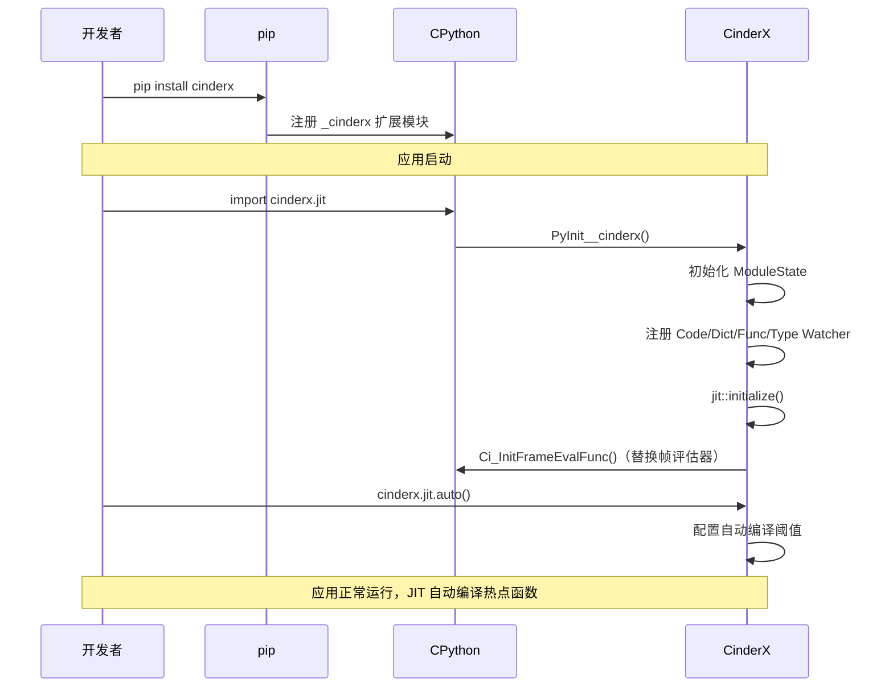

### 3.5.2、JIT 自动编译场景

开发者启用 `cinderx.jit.auto()` 后，函数的编译和执行完全自动进行：

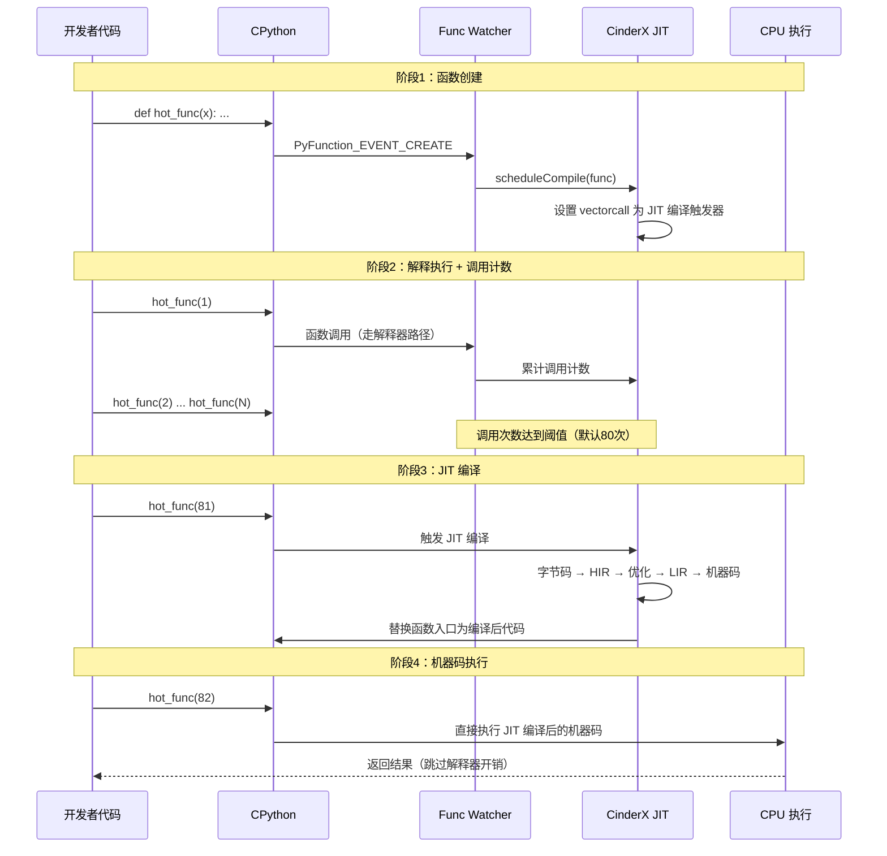

### 3.5.3、手动编译场景

开发者可以精确控制哪些函数需要编译：

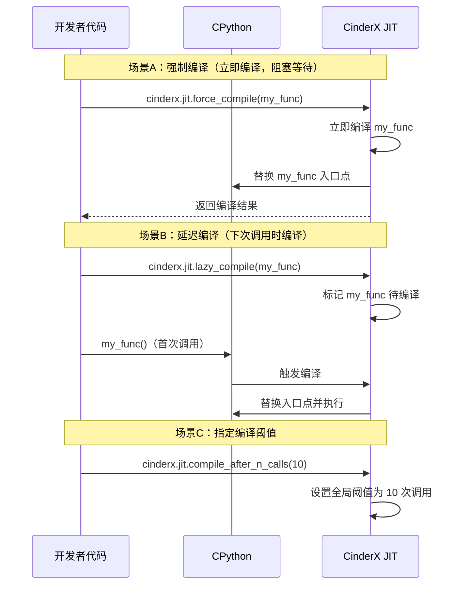

### 3.5.4、去优化场景

当 JIT 编译的代码遇到无法处理的运行时条件时，自动回退到解释器：

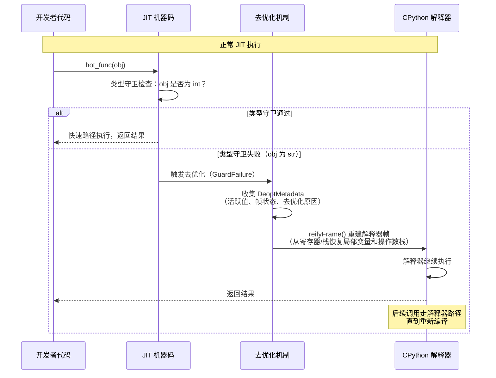

### 3.5.5、Static Python 场景

开发者使用 Static Python 获得更激进的类型特化优化：

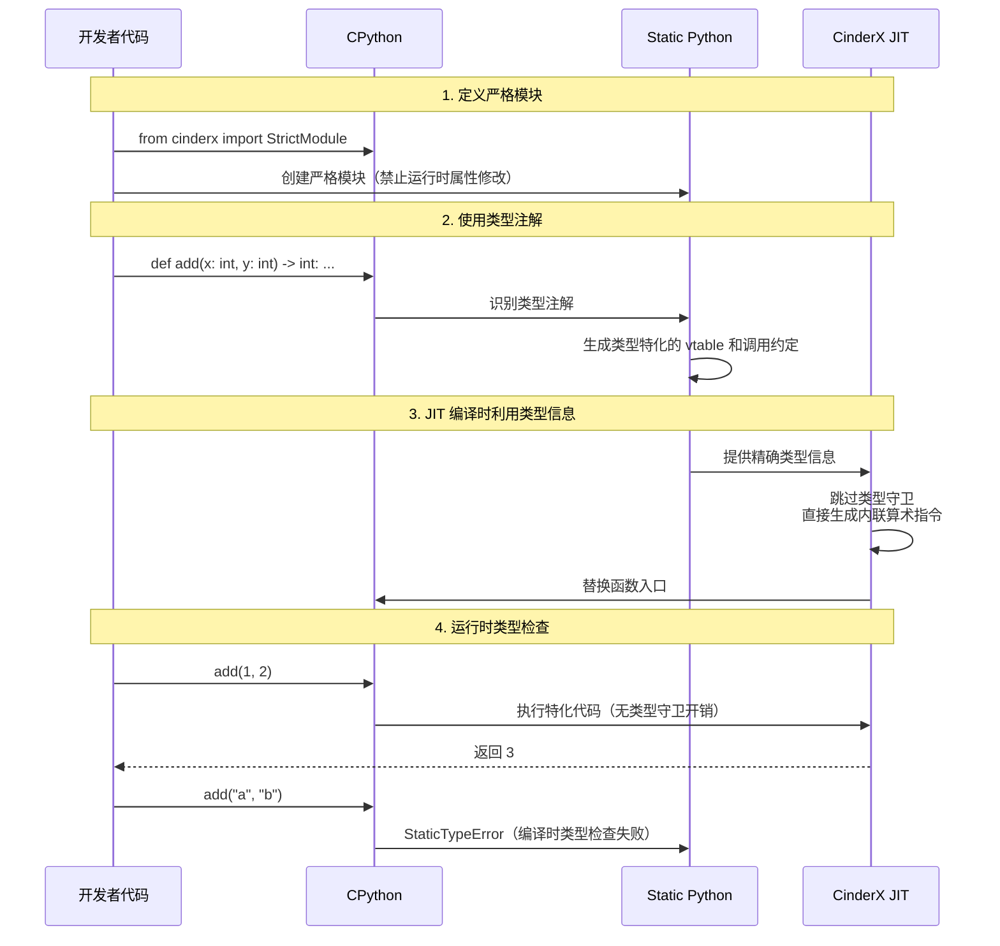

### 3.5.6、运行时状态切换

CinderX 的 JIT 编译器在运行时有明确的生命周期状态：

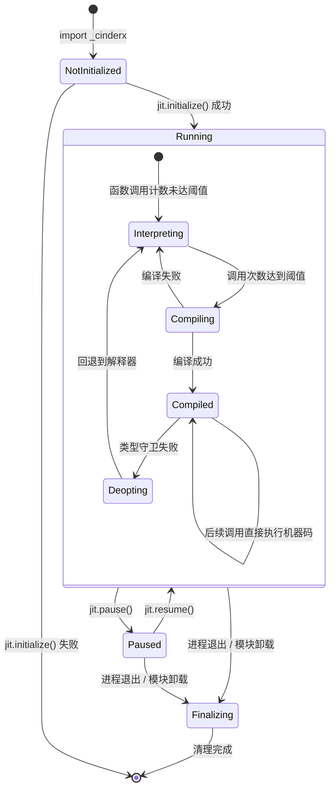

## 3.6、质量属性设计

### 3.6.1、性能规格

| 规格名称 | 规格指标 |
|:--|:-------|
| JIT 编译延迟 | 热点函数自动编译阈值可配置（默认 80 次调用） |
| 内存开销 | JIT 代码段内存占用可配置上限 |
| 编译吞吐 | 支持多线程批量编译 |
| 去优化开销 | 单次去优化微秒级延迟 |

### 3.6.2、系统可靠性设计

1. **去优化安全**：所有 JIT 代码都有对应的去优化路径，确保可以安全回退到解释器
2. **引用计数正确性**：通过 `Ref`/`BorrowedRef` 类型系统确保引用计数正确
3. **监听器一致性**：通过监听器机制确保 JIT 代码与运行时状态同步

### 3.6.3、安全性设计

1. **审计钩子**：通过 `audit.h` 封装审计机制
2. **类型安全**：Static Python 提供编译时类型检查
3. **内存安全**：使用智能指针管理对象生命周期

### 3.6.4、兼容性设计

1. **多版本支持**：通过 `py-portability.h` 层屏蔽版本差异
2. **渐进式采用**：可以只启用部分功能（如仅 JIT 或仅 Static Python）
3. **回退机制**：任何优化都有回退到标准解释器的路径

### 3.6.5、可服务性设计

1. **调试支持**：GDB 集成、符号化支持
2. **性能分析**：perf jitdump 支持
3. **日志系统**：可配置的日志级别和输出

### 3.6.6、可测试性设计

1. **模块化设计**：各组件可独立测试
2. **去优化测试**：专门的去优化测试框架
3. **多版本测试**：CI 支持多 Python 版本测试

## 3.7、特性清单

| no | 特性描述 | 代码估计规模 | 实现版本 |
|:--|:-------|:------|:----|
| 1 | JIT 编译器核心 | ~50K LOC | 3.14+ |
| 2 | Static Python | ~20K LOC | 3.14+ |
| 3 | 多版本移植层 | ~5K LOC | 3.14+ |
| 4 | 帧评估器替换 | ~3K LOC | 3.14+ |
| 5 | 去优化机制 | ~5K LOC | 3.14+ |
| 6 | 轻量级帧 | ~2K LOC | 3.14+ |
| 7 | 缓存属性 | ~1K LOC | 3.14+ |

## 3.8、接口清单

### 3.8.1、外部接口清单

| 接口名称 | 接口描述 | 入参 | 输出 | 异常 |
|:-------|:------|:---|:---|:---|
| cinderx.jit.auto() | 启用自动 JIT 编译 | 无 | None | RuntimeError |
| cinderx.jit.force_compile(func) | 强制编译函数 | 函数对象 | bool | TypeError |
| cinderx.jit.lazy_compile(func) | 延迟编译函数 | 函数对象 | None | TypeError |
| cinderx.install_frame_evaluator() | 安装帧评估器 | 无 | None | RuntimeError |
| cinderx.clear_caches() | 清除 JIT 缓存 | 无 | None | - |

### 3.8.2、内部接口清单

| 模块 | 接口名称 | 接口描述 | 入参 | 输出 | 异常 |
|:----|:-------|:------|:---|:---|:---|
| Common | codeExtra() | 获取代码对象扩展数据 | PyCodeObject* | CodeExtra* | - |
| Common | typeLookupSafe() | 安全的类型查找 | PyTypeObject*, name | PyObject* | - |
| Interpreter | Ci_EvalFrame() | 帧评估函数 | tstate, frame, throwflag | PyObject* | - |
| Jit | jit::initialize() | 初始化 JIT | 无 | int | - |
| Jit | jit::compileFunction() | 编译函数 | PyFunctionObject* | Result | - |
| Jit | jit::scheduleJitCompile() | 调度编译 | PyFunctionObject* | bool | - |
| Deopt | reifyFrame() | 重建解释器帧 | frame, meta, regs | void | - |

# 4、修改日志

| 版本 | 发布说明 |
|:--|:-------|
| 1.0 | 初始架构文档，基于代码库实际实现更新，重点体现 CinderX 与 CPython 边界设计 |
| 1.1 | 图表改用 Mermaid 表达；运行视图改为开发者使用 CinderX 发布件的视角 |
| 1.2 | 移除并行 GC 相关内容（受益人、需求、接口、场景、特性清单等）；CPython 版本范围统一为 3.14.3+，暂不兼容 Meta 分支；运行环境更新为 Linux ARM64/X86_64，不支持 macOS/Windows；构建系统改为以 wheel 包为产物的流水线描述 |

# 5、参考目录

- [Cinder JIT Dev Guide](Jit/guide.md)
- [Deoptimization](Jit/deoptimization.md)
- [HIR Type System](Jit/hir/type.md)
- [Static Python README](StaticPython/README.md)
- [Strict Modules Guide](StrictModules/guide/index.rst)
